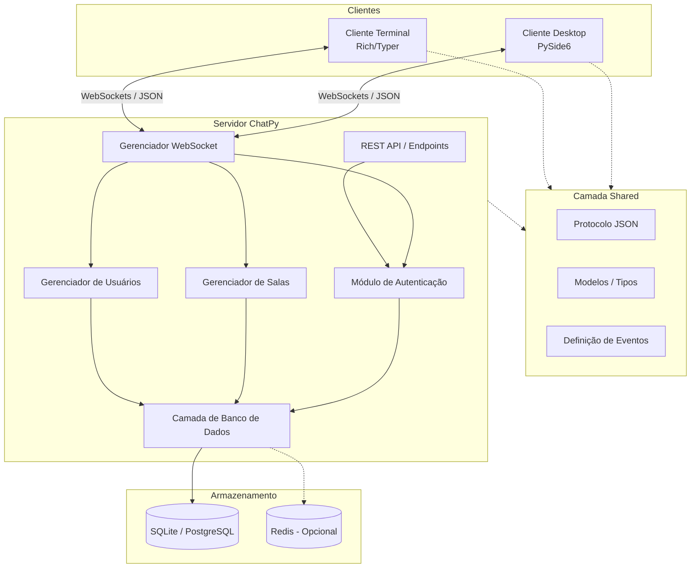

# Diagrama de Componentes

```mermaid
graph TD
    subgraph Clientes
        GUI[Cliente Desktop<br>PySide6] 
        CLI[Cliente Terminal<br>Rich/Typer]
    end

    subgraph Shared[Camada Shared]
        Protocolo[Protocolo JSON]
        Tipos[Modelos / Tipos]
        Eventos[Definição de Eventos]
    end

    subgraph Servidor[Servidor ChatPy]
        API[REST API / Endpoints]
        WS[Gerenciador WebSocket]
        Auth[Módulo de Autenticação]
        Rooms[Gerenciador de Salas]
        Users[Gerenciador de Usuários]
        DB_Layer[Camada de Banco de Dados]
    end

    subgraph Armazenamento
        SQLite[(SQLite / PostgreSQL)]
        Redis[(Redis - Opcional)]
    end

    GUI <-->|WebSockets / JSON| WS
    CLI <-->|WebSockets / JSON| WS
    
    WS --> Auth
    WS --> Rooms
    WS --> Users
    
    API --> Auth
    
    Auth --> DB_Layer
    Rooms --> DB_Layer
    Users --> DB_Layer
    
    DB_Layer --> SQLite
    DB_Layer -.-> Redis
    
    GUI -.-> Shared
    CLI -.-> Shared
    Servidor -.-> Shared
```
